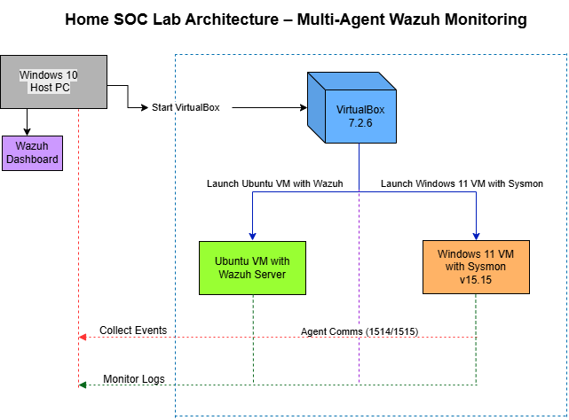

# SOC Analyst Portfolio – Ahmed Salam

Building hands-on cybersecurity skills with CompTIA Security+ as foundation — real projects demonstrating SOC Analyst capabilities.

## Home SOC Lab – Multi-Agent Wazuh Monitoring

Deployed a complete monitoring lab from scratch using VirtualBox:

- **Host**: Windows 10  
- **Hypervisor**: VirtualBox 7.2.6  
- **SIEM Server**: Ubuntu 24.04 LTS running Wazuh all-in-one (manager + indexer + dashboard)  
- **Endpoint**: Windows 11 Enterprise Evaluation with Sysmon v15.15 for enhanced logging  
- **Access**: Dashboard live at http://192.168.12.126:5601 (HTTP for lab simplicity)  
- **Agents**: Manager self-monitoring (ID 000) + Windows agent enrolled & active  

### Key Outcomes
- Real-time event collection from Sysmon (process creation, file changes, network)  
- Multi-agent visibility in Wazuh dashboard  
- Solved real-world issues: config validation, port binding (1514/1515), SSL fallback, agent enrollment  

### Architecture Diagram

### Technologies & Tools Used
- Wazuh (SIEM, agent enrollment, dashboard)  
- Sysmon (endpoint visibility)  
- VirtualBox (lab virtualization)  
- Ubuntu Server 24.04 LTS  
- Windows 11 Enterprise Evaluation  

### Challenges Overcome
- Deprecated config keys (opensearch.requestHeadersAllowlist)  
- Node.js port 443 binding (setcap)  
- Agent connectivity & registration troubleshooting  
- SSL handshake issues → reliable HTTP fallback  

## Key Configuration Files

All configs and commands used in the lab are in the [`/configs`](configs) folder:

- [`/opensearch_dashboards.yml`](/configs/opensearch_dashboards.yml) — Dashboard config (HTTP fallback after troubleshooting)
- [`/sysmonconfig-export.xml`](/configs/sysmonconfig-export.xml) — SwiftOnSecurity Sysmon config for endpoint visibility
- [`/wazuh-agent-install-command.txt`](/configs/wazuh-agent-install-command.txt) — Windows agent install command
- [`/sysmon-install-command.txt`](/configs/sysmon-install-command.txt) — Sysmon install command
- [`/agent_control-l-output.txt`](/configs/agent_control-l-output.txt) — Manager-side agent list (showing multi-agent enrollment)

### Screenshots & Proof
Screenshots: 📸 Browse all phase screenshots in the [/screenshots folder](screenshots) (organized as phase01,phase02 & phase03)  
Key highlights: VM creation, Wazuh install output, Sysmon events, multi-agent dashboard, agent_control -l

### Video Walkthrough
[Loom video link – coming soon]

### Next Phase
Core SOC simulations: brute-force detection, phishing analysis, custom rules, incident response playbooks.

## Connect
- LinkedIn: [Ahmed Salam](https://www.linkedin.com/in/ahmedsalamnyc)  
- X: [@imahmedsalam](https://x.com/imahmedsalam)  
- GitHub: [iamahmedsalam](https://github.com/iamahmedsalam)  
- Personal site : [iamahmedsalam.com](https://iamahmedsalam.com)

Open to feedback, suggestions, and collaboration!
