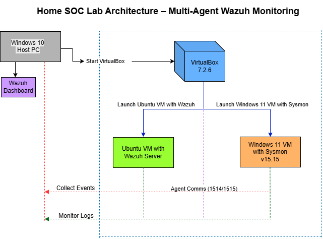

# SOC Analyst Portfolio — Ahmed Salam

**Aspiring AI-Augmented SOC Analyst** building real detection capabilities through hands-on labs, custom SIEM rules, and documented incident response.

> CompTIA Security+ Certified | TryHackMe Top 2% (132 rooms, 30 badges) | SOC Level 1 Certified

🌐 **Portfolio:** [iamahmedsalam.com](https://iamahmedsalam.com)

---

## Projects

### 🛡️ [Home SOC Lab v2.0](https://github.com/iamahmedsalam/home-soc-lab)

A production-grade SOC home lab — 4-VM environment with custom detection engineering, real attack simulation, and professional incident response documentation.

**What I built:**
- Multi-platform Wazuh SIEM (v4.14.4) monitoring Windows 11 + Ubuntu endpoints
- 10 custom detection rules mapped to MITRE ATT&CK techniques
- Atomic Red Team adversary simulation — 8/10 techniques detected
- 3 professional incident reports with full forensic evidence from real alerts

**Key technical details:**
- Sysmon v15.15 with Olaf Hartong modular config for endpoint telemetry
- PCRE2 regex with case-insensitive flags for evasion-resistant detection
- Host-Only networking (192.168.56.0/24) for stable lab communication
- Discovered Wazuh 4.14.4 uses `sysmon_eid1_detections` group naming (not older `sysmon_event1` format)

**Detection coverage:** T1059.001, T1003.001, T1547.001, T1136.001, T1070.001, T1055, T1105, T1021.001, T1083

| | |
|---|---|
| **Repo** | [github.com/iamahmedsalam/home-soc-lab](https://github.com/iamahmedsalam/home-soc-lab) |
| **Detection Rules** | [local_rules.xml](https://github.com/iamahmedsalam/home-soc-lab/blob/main/detection-rules/local_rules.xml) |
| **Incident Reports** | [IR-001](https://github.com/iamahmedsalam/home-soc-lab/blob/main/incident-reports/IR-001-powershell-encoded-command.md) · [IR-002](https://github.com/iamahmedsalam/home-soc-lab/blob/main/incident-reports/IR-002-registry-run-key-persistence.md) · [IR-003](https://github.com/iamahmedsalam/home-soc-lab/blob/main/incident-reports/IR-003-windows-event-log-cleared.md) |
| **Simulation Results** | [Full detection matrix](https://github.com/iamahmedsalam/home-soc-lab/blob/main/attack-simulations/simulation-results.md) |

---

### 🔬 Home SOC Lab v1.0 (Foundation)

The original 2-VM lab that started it all — Wazuh Manager + Windows 11 endpoint with Sysmon. Deployed from scratch, troubleshot real issues (config validation, port binding, SSL fallback, agent enrollment), and documented everything. This became the foundation for the v2.0 upgrade.

**Architecture:**

**Technologies:** Wazuh, Sysmon (SwiftOnSecurity config), VirtualBox, Ubuntu 24.04 LTS, Windows 11

---

## Certifications

| Certification | Platform | Status |
|---|---|---|
| CompTIA Security+ | CompTIA | ✅ Certified |
| SOC Level 1 | TryHackMe | ✅ Completed (April 2026) |

---

## TryHackMe Progress

| Metric | Value |
|---|---|
| Global Ranking | **Top 2%** |
| Rooms Completed | 132 |
| Badges Earned | 30 |
| Learning Path | SOC Level 1 (completed) |

---

## Skills Demonstrated

**Detection Engineering:** Custom Wazuh rule authoring, PCRE2 regex, MITRE ATT&CK mapping, Sysmon event ID analysis, `if_sid` vs `if_group` chaining, XML validation workflow

**Attack Simulation:** Atomic Red Team execution, purple team methodology, detection gap analysis, OS hardening assessment (Credential Guard, LSA Protection)

**Incident Response:** Professional IR documentation (Executive Summary → Timeline → Evidence → Investigation → Root Cause → Containment → Lessons Learned), forensic artifact extraction from SIEM alerts

**SIEM Operations:** Wazuh deployment and configuration, multi-platform agent enrollment, custom dashboard creation, centralised log forwarding architecture

**Endpoint Monitoring:** Sysmon configuration and tuning, Windows Event Log analysis, process creation / registry / file creation / process access event correlation

---

## What's Next

- AI-Augmented Alert Triage — LLM integration with Wazuh pipeline
- Threat Intel Integration — MISP/OTX feed enrichment
- SOC Level 2 — TryHackMe
- HackTheBox CJCA certification

---

## Connect

- 🌐 Portfolio: [iamahmedsalam.com](https://iamahmedsalam.com)
- 💼 LinkedIn: [Ahmed Salam](https://www.linkedin.com/in/ahmedsalamnyc)
- 🐙 GitHub: [iamahmedsalam](https://github.com/iamahmedsalam)
- ✉️ Email: [contact@iamahmedsalam.com](mailto:contact@iamahmedsalam.com)
