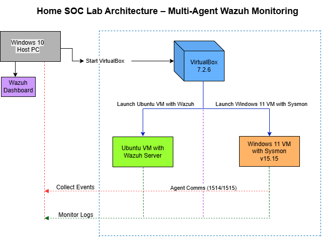

# SOC Analyst Portfolio — Ahmed Salam

**AI-Augmented SOC Analyst** building real detection capabilities through hands-on labs, custom SIEM rules, and documented incident response.

> CompTIA Security+ Certified | TryHackMe Top 2% (132 rooms, 30 badges) | SOC Level 1 Certified

🌐 **Portfolio:** [iamahmedsalam.com](https://iamahmedsalam.com)

---

## Projects

### 🛡️ [Home SOC Lab v2.0](https://github.com/iamahmedsalam/home-soc-lab)

A production-grade SOC home lab — 4-VM environment with custom detection engineering, real attack simulation, and professional incident response documentation.

**What I built:**
- Multi-platform Wazuh SIEM (v4.14.4) monitoring Windows 11 + Ubuntu endpoints
- 10 custom detection rules mapped to MITRE ATT&CK techniques
- Atomic Red Team adversary simulation — 8/10 techniques detected
- 3 professional incident reports with full forensic evidence from real alerts

**Key technical details:**
- Sysmon v15.15 with Olaf Hartong modular config for endpoint telemetry
- PCRE2 regex with case-insensitive flags for evasion-resistant detection
- Host-Only networking (192.168.56.0/24) for stable lab communication
- Discovered Wazuh 4.14.4 uses `sysmon_eid1_detections` group naming (not older `sysmon_event1` format)

**Detection coverage:** T1059.001, T1003.001, T1547.001, T1136.001, T1070.001, T1055, T1105, T1021.001, T1083

| | |
|---|---|
| **Repo** | [github.com/iamahmedsalam/home-soc-lab](https://github.com/iamahmedsalam/home-soc-lab) |
| **Detection Rules** | [local_rules.xml](https://github.com/iamahmedsalam/home-soc-lab/blob/main/detection-rules/local_rules.xml) |
| **Incident Reports** | [IR-001](https://github.com/iamahmedsalam/home-soc-lab/blob/main/incident-reports/IR-001-powershell-encoded-command.md) · [IR-002](https://github.com/iamahmedsalam/home-soc-lab/blob/main/incident-reports/IR-002-registry-run-key-persistence.md) · [IR-003](https://github.com/iamahmedsalam/home-soc-lab/blob/main/incident-reports/IR-003-windows-event-log-cleared.md) |
| **Simulation Results** | [Full detection matrix](https://github.com/iamahmedsalam/home-soc-lab/blob/main/attack-simulations/simulation-results.md) |

---

### 🔰 [Incident Response Playbooks + Live Drills](https://github.com/iamahmedsalam/incident-response-playbooks)

5 professional IR playbooks validated through live attack drills — proving the full SOC L1 workflow from alert triage through investigation, containment, and documentation.

**What I built:**
- 5 reusable playbooks covering Execution, Credential Access, Persistence, Defence Evasion, and Command & Control
- 5 live drill reports with real Wazuh alert artifacts, timestamps, and forensic evidence
- 1 new detection rule (Rule 100011 — SSH Brute Force) expanding coverage to Linux
- 12 detection improvement recommendations discovered through hands-on investigation

**Key findings:**
- MTTD consistently < 3 seconds across all 5 drills
- Identified 2 LOLBINs (reg.exe, certutil.exe) used in attack simulations
- Recovered full multi-stage attack timeline from SIEM after local log destruction
- Caught malware dropper before execution — quarantined with hash preserved

| | |
|---|---|
| **Repo** | [github.com/iamahmedsalam/incident-response-playbooks](https://github.com/iamahmedsalam/incident-response-playbooks) |
| **Playbooks** | [PB-001](https://github.com/iamahmedsalam/incident-response-playbooks/blob/main/playbooks/PB-001-powershell-execution.md) · [PB-002](https://github.com/iamahmedsalam/incident-response-playbooks/blob/main/playbooks/PB-002-ssh-brute-force.md) · [PB-003](https://github.com/iamahmedsalam/incident-response-playbooks/blob/main/playbooks/PB-003-registry-persistence.md) · [PB-004](https://github.com/iamahmedsalam/incident-response-playbooks/blob/main/playbooks/PB-004-event-log-cleared.md) · [PB-005](https://github.com/iamahmedsalam/incident-response-playbooks/blob/main/playbooks/PB-005-malware-dropper-temp.md) |
| **Live Drills** | [Drill 001](https://github.com/iamahmedsalam/incident-response-playbooks/blob/main/live-drills/drill-001-powershell.md) · [Drill 002](https://github.com/iamahmedsalam/incident-response-playbooks/blob/main/live-drills/drill-002-ssh-bruteforce.md) · [Drill 003](https://github.com/iamahmedsalam/incident-response-playbooks/blob/main/live-drills/drill-003-registry-persistence.md) · [Drill 004](https://github.com/iamahmedsalam/incident-response-playbooks/blob/main/live-drills/drill-004-event-log-cleared.md) · [Drill 005](https://github.com/iamahmedsalam/incident-response-playbooks/blob/main/live-drills/drill-005-malware-dropper.md) |
| **Detection Improvements** | [Rule tuning log](https://github.com/iamahmedsalam/incident-response-playbooks/blob/main/detection-improvements/rule-tuning-log.md) |

---

### 🛰️ [Threat Intelligence Integration](https://github.com/iamahmedsalam/threat-intel-integration)

Production-quality Python enrichment engine correlating live Wazuh alerts against 3 threat intelligence sources — self-hosted MISP, AlienVault OTX, and AbuseIPDB — with automated containment and 4 live-fire drills.

**What I built:**
- Python enrichment engine (config, logging, SQLite caching, 3 API clients) with 19 automated pytest tests
- Self-hosted MISP platform (Docker) subscribed to the CIRCL OSINT feed
- 5 new Wazuh detection rules (100012–100016) turning enrichment verdicts into dashboard alerts
- Automated containment: direct iptables blocking with cron-based auto-unblock
- 4 live drills, including a unified multi-stage incident (brute force → payload staging → C2 callback → automated containment)

**Key findings:**
- Caught 2 real false positives through multi-source correlation (Google DNS via MISP alone; a cross-source hash-collision on an empty-file SHA256)
- Discovered and engineered around a real Wazuh reliability bug — native Active Response dispatch was intermittently silent-failing (matches upstream issue wazuh/wazuh#9370); built a direct-invocation containment architecture instead, proven 100% reliable
- Auto-unblock timing validated accurate (618s / 622s against a 600s configured timeout)

| | |
|---|---|
| **Repo** | [github.com/iamahmedsalam/threat-intel-integration](https://github.com/iamahmedsalam/threat-intel-integration) |
| **Live Drills** | [Drill 1](https://github.com/iamahmedsalam/threat-intel-integration/blob/main/live-drills/drill-001-ssh-bruteforce-intel.md) · [Drill 2](https://github.com/iamahmedsalam/threat-intel-integration/blob/main/live-drills/drill-002-hash-attribution.md) · [Drill 3](https://github.com/iamahmedsalam/threat-intel-integration/blob/main/live-drills/drill-003-c2-callback-block.md) · [Drill 4](https://github.com/iamahmedsalam/threat-intel-integration/blob/main/live-drills/drill-004-multistage-attack-chain.md) |
| **Architecture** | [Pipeline design doc](https://github.com/iamahmedsalam/threat-intel-integration/blob/main/architecture/pipeline-architecture.md) |
| **Lessons Learned** | [Full AR debugging story](https://github.com/iamahmedsalam/threat-intel-integration/blob/main/docs/lessons-learned.md) |

---

### 🔬 Home SOC Lab v1.0 (Foundation)

The original 2-VM lab that started it all — Wazuh Manager + Windows 11 endpoint with Sysmon. Deployed from scratch, troubleshot real issues (config validation, port binding, SSL fallback, agent enrollment), and documented everything. This became the foundation for the v2.0 upgrade.

**Architecture:**

**Technologies:** Wazuh, Sysmon (SwiftOnSecurity config), VirtualBox, Ubuntu 24.04 LTS, Windows 11

---

## Certifications

| Certification | Platform | Status |
|---|---|---|
| CompTIA Security+ | CompTIA | ✅ Certified (Active) |
| SOC Level 1 | TryHackMe | ✅ Completed (April 2026) |

---

## TryHackMe Progress

| Metric | Value |
|---|---|
| Global Ranking | **Top 2%** |
| Rooms Completed | 132 |
| Badges Earned | 30 |
| Learning Path | SOC Level 1 (completed) |

---

## Skills Demonstrated

**Detection Engineering:** Custom Wazuh rule authoring (16 rules), PCRE2 regex, MITRE ATT&CK mapping, Sysmon event ID analysis, `if_sid` vs `if_group` chaining, XML validation workflow

**Incident Response:** 5 professional IR playbooks, live drill execution, alert triage decision trees, forensic artifact extraction, attack chain correlation, evidence-preserving containment (quarantine vs delete)

**Threat Intelligence:** Multi-source correlation (MISP, AlienVault OTX, AbuseIPDB), self-hosted MISP administration, IOC/hash attribution, automated verdict logic, false-positive investigation

**Automation & Development:** Python (API integration, caching, structured logging, pytest), production-quality code architecture, automated containment (direct iptables blocking, cron-based expiration)

**Attack Simulation:** Atomic Red Team execution, Hydra brute force, purple team methodology, detection gap analysis, OS hardening assessment (Credential Guard, LSA Protection), LOLBIN identification (reg.exe, certutil.exe)

**SIEM Operations:** Wazuh deployment and configuration, multi-platform agent enrollment, custom dashboard creation, centralised log forwarding architecture, SIEM evidence recovery after local log destruction

**Endpoint Monitoring:** Sysmon configuration and tuning, Windows Event Log analysis, Linux auth.log analysis, process creation / registry / file creation / process access event correlation

---

## What's Next

- AI-Augmented Alert Triage — LLM integration with Wazuh pipeline
- Cloud SIEM — Microsoft Sentinel + KQL detection engineering
- HackTheBox CJCA certification
- Splunk specialization (Core Power User + CDA)

---

## Connect

- 🌐 Portfolio: [iamahmedsalam.com](https://iamahmedsalam.com)
- 💼 LinkedIn: [Ahmed Salam](https://www.linkedin.com/in/ahmedsalamnyc)
- 🐙 GitHub: [iamahmedsalam](https://github.com/iamahmedsalam)
- ✉️ Email: [contact@iamahmedsalam.com](mailto:contact@iamahmedsalam.com)
